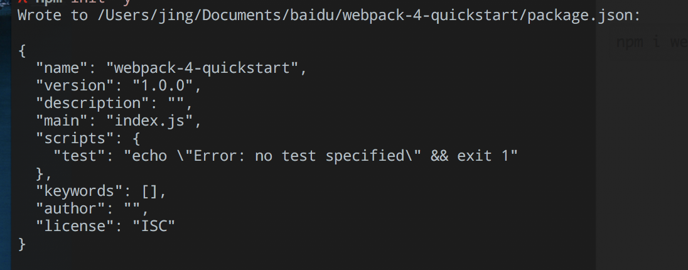
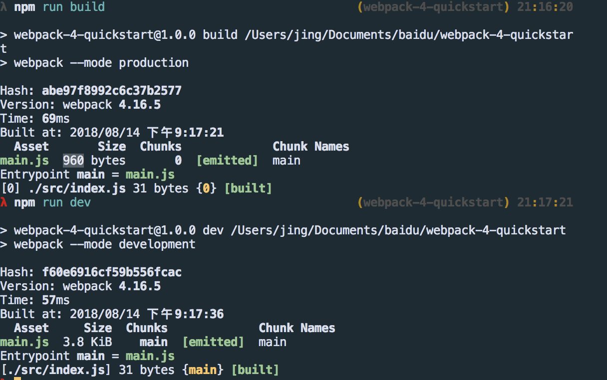
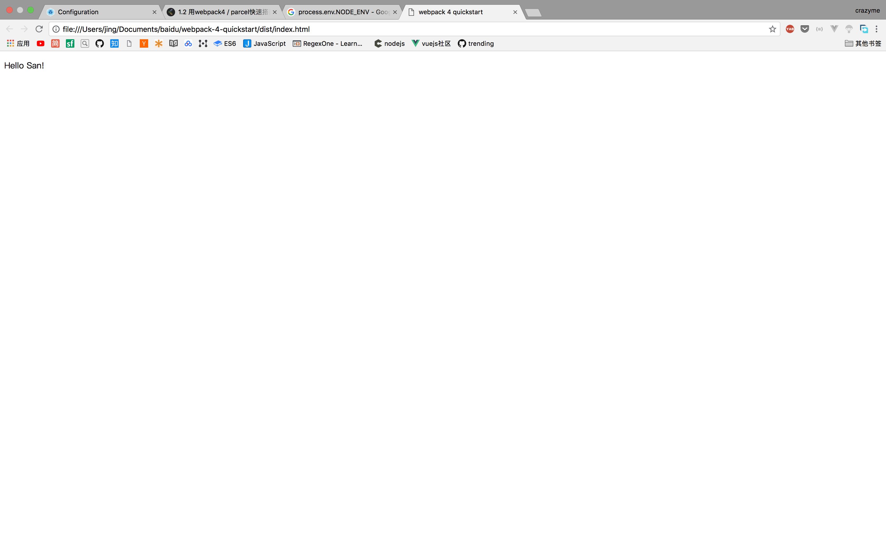
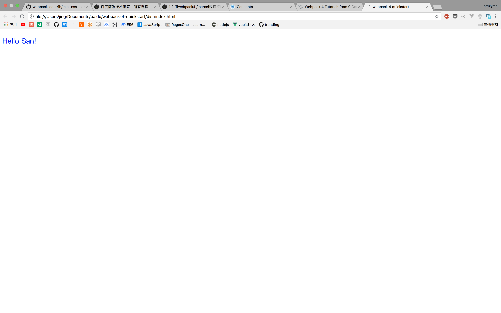

# 1.2 webpack 4

## 从零开始(zero conf)

**webpack 4默认并不需要配置文件**

创建并进入一个文件夹

```
mkdir webpack-4-quickstart && cd webpack-4-quickstart;
```

```
npm init -y
```


```
npm i webpack webpack-cli --save-dev
```
打开`package.json`, 加入build script

```javascript
"scripts": {
  "build": "webpack"
}
```
运行

```
npm run build
```

```
WARNING in configuration
The 'mode' option has not been set, webpack will fallback to 'production' for this value. Set 'mode' option to 'development' or 'production' to enable defaults for each environment.
You can also set it to 'none' to disable any default behavior. Learn more: https://webpack.js.org/concepts/mode/

ERROR in Entry module not found: Error: Can't resolve './src' in '/Users/jing/Documents/baidu/webpack-4-quickstart'
```
* warning: webpack 默认为`production` mode
* error: webpack 在寻找入口`./src`
  * webpack 4 把 `./src/index.js`作为默认的入口文件
 
创建`src`文件夹和 `src/index.js`文件 

```
mkdir src && cd src
echo "console.log(`This is a test!`)" >> index.js
``` 

再次运行

```
npm run build
```

得到`~/webpack-4-quickstart/dist/main.js`

以下是`webpack-4-quickstart`的目录

```
.
├── dist
│   └── main.js
├── package-lock.json
├── package.json
└── src
    └── index.js

```
运行 `./dist/main.js`

```
node ./dist/main.js
This is a test!
```

## production和development

刚才的`warning`说明 webpack 默认是`production` mode

但这到底是什么意思呢？

打开`package.json`

```json
"scripts": {
  "dev": "webpack --mode development",
  "build": "webpack --mode production"
}

```
运行

```
npm run dev
```
看一下 `./dist/main.js`, **没有被压缩**

```
npm run build
```
在看一下`./dist/main.js`, **被压缩**



[官方mode介绍](https://webpack.js.org/concepts/mode/) 很无聊

简单来说,

*  **Production mode**可以优化代码， 包括压缩， 去掉没有用过的代码(tree-shaking)，作用域提升等

一般来说, webpack会有两个配置文件

* 一个配置文件用于 `development` 
* 另一个用于`production`

## 配置san webpack 

[webpack基本概念](https://webpack.js.org/concepts/)

[san的github](https://github.com/baidu/san)

基本概念官网已经介绍的很清楚了，这里不重复了。

安装`san`, `babel-loader`, 和`babel-core`

```
npm i san babel-loader babel-core --save-dev
```
### babel-loader

新建并打开`webpack.config.js`

```javascript
module.exports = {
    module: {
        rules: [{
            test: /\.js$/,
            exclude: /node_modules/,
            loader: "babel-loader"
        }]
    }
};
```
测试`babel-loader`

`src/index.js` 使用es6 箭头函数

```javascript
let test = () => {
    console.log("This is a test")
}

test()
```

```bash
npm run build
node ./dist/index.js
This is a test
```
`babel-laoder`配置成功

### HTML plugin

webpack 需要两个组件(`html-webpack-plugin`,`html-loader` )来处理HTML

```
npm i html-webpack-plugin html-loader --save-dev
```

更新`webpack.config.js`

```javascript

const HtmlWebPackPlugin = require("html-webpack-plugin");
module.exports = {
  module: {
    rules: [
      {
        test: /\.js$/,
        exclude: /node_modules/,
        use: {
          loader: "babel-loader"
        }
      },
      {
        test: /\.html$/,
        use: [
          {
            loader: "html-loader",
            options: { minimize: true }
          }
        ]
      }
    ]
  },
  plugins: [
    new HtmlWebPackPlugin({
      template: "./src/index.html",
      filename: "./index.html"
    })
  ]
};
```
新建`./src/index.html` 并加入以下内容

```html
<!DOCTYPE html>
<html lang="en">
<head>
    <meta charset="utf-8">
    <title>webpack 4 quickstart</title>
    <script src="https://unpkg.com/san@latest/dist/san.dev.js"></script>
</head>
<body>
    <script>
        var MyApp = san.defineComponent({
            template: '<p>Hello {{name}}!</p>',
            initData: function () {
                return {
                    name: 'San'
                };
            }
        });
        var myApp = new MyApp();
        myApp.attach(document.body);
    </script>
</body>
</html>

```

```
node run build
```
打开`./dist/index.html`



`html-webpack-plugin`,`html-loader` 配置成功

### CSS plugin


安装`css-loader`和`mini-css-extract-plugin`

```
npm i mini-css-extract-plugin css-loader --save-dev
```

创建需要测试的css文件

```
/* */
/* CREATE THIS FILE IN ./src/main.css */
/* */

body {
    font-size: 24px;
}
```

更新 `webpack.config.js`

```
const HtmlWebPackPlugin = require("html-webpack-plugin");
const MiniCssExtractPlugin = require("mini-css-extract-plugin");
module.exports = {
  module: {
    rules: [
      {
        test: /\.js$/,
        exclude: /node_modules/,
        use: {
          loader: "babel-loader"
        }
      },
      {
        test: /\.html$/,
        use: [
          {
            loader: "html-loader",
            options: { minimize: true }
          }
        ]
      },
      {
        test: /\.css$/,
        use: [MiniCssExtractPlugin.loader, "css-loader"]
      }
    ]
  },
  plugins: [
    new HtmlWebPackPlugin({
      template: "./src/index.html",
      filename: "./index.html"
    }),
    new MiniCssExtractPlugin({
      filename: "[name].css",
      chunkFilename: "[id].css"
    })
  ]
};

```

在`./src/index.js`加入以下内容

```

import style from "./main.css";
```

运行

```
npm run build
```

打开`./dist/index.html`



`css-loader`和`mini-css-extract-plugin`配置成功

### webpack dev server

如果，每一次更改代码都要运行一次`npm run dev`, 是不是很麻烦?

`webpack-dev-server` 就是来解决这个问题的，每一次更改文件，它都会自动刷新浏览器.

[devServer](https://webpack.js.org/configuration/dev-server/)

安装`webpack-dev-server`

```
npm i webpack-dev-server --save-dev
```

修改`package.json`

```
"scripts": {
  "dev": "webpack-dev-server --mode development --open",
  "build": "webpack --mode production"
}
```
运行`npm run dev`


可以看到，修改文件并保存后，浏览器会实时显示代码变化.


TO BE CONTINUE